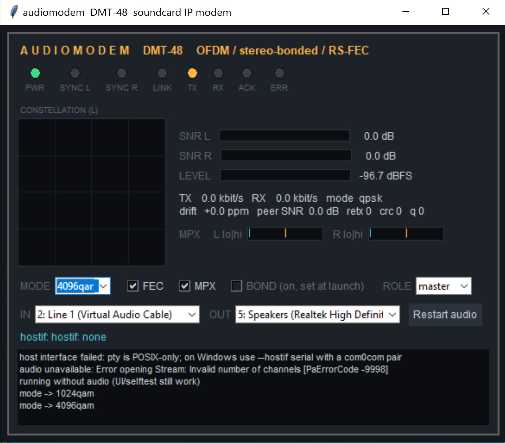
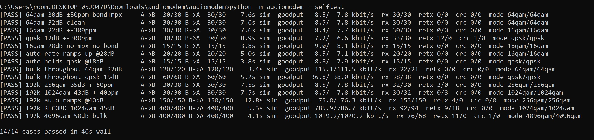

# 📻 audiomodem 
**TCP/IP over a soundcard, up to ~2 Mbit/s aggregate full-duplex**

[](#requirements)
[](LICENSE)
[](#requirements)

> A software modem that turns two PCs' soundcards into a point-to-point network link. It modulates IP packets onto audio with OFDM (DMT), bonds the left and right stereo channels into two parallel lanes, protects everything with Reed-Solomon FEC and an ARQ with fast retransmit, and hands packets to the OS through various virtual interfaces. Written in pure Python + NumPy.

### 📸 Screenshots
*Click images to expand*

<p align="center">
  <a href="screenshot1.jpg" target="_blank">
    
  </a> <br>
  <a href="screenshot2.jpg" target="_blank">
    
  </a>
</p>

---

## 1. Install

```bash
pip install numpy sounddevice         # sounddevice needs PortAudio
pip install pyserial                  # only required for --hostif serial
sudo apt install python3-tk           # only required for the UI on Linux
```

Run the bundled regression suite:

Test 14 simulated-cable scenarios in about 90 seconds without a soundcard:

```bash
python -m audiomodem --selftest
```

## 2. Wiring and OS Setup

### Cabling

Connect two stereo 3.5 mm TRS cables, crossed.

Each PC's line-out must go into the other PC's line-in.

Bonding uses both left and right channels, so do **not** use mono cables.

### OS Audio Configuration

For the 192k profile, set both machines' playback and capture devices to:

```text
24-bit, 192000 Hz
```

Windows:

```text
Sound Control Panel → Device → Advanced → Default Format
```

Linux:

ALSA usually follows requested rates automatically. PipeWire/Pulse users may need to allow 192 kHz in the daemon config.

**CRITICAL:** Disable all audio enhancements on both ends:

* Loudness EQ
* Noise suppression
* Echo cancellation
* AGC
* Spatial sound

These will destroy the waveform.

### Volume

Set levels to about 80%.

The RX level meter should sit around:

```text
-20 to -10 dBFS
```

## 3. Usage

### Linux SLIP Example

On PC 1:

```bash
python -m audiomodem --fs 192000
```

The log should show something like:

```text
host interface: pty /dev/pts/4 (slip)
```

Then run:

```bash
sudo slattach -L -p slip /dev/pts/4
sudo ifconfig sl0 10.0.0.1 pointopoint 10.0.0.2 mtu 1500 up
```

On PC 2:

Repeat the same commands with the IPs swapped:

```bash
sudo slattach -L -p slip /dev/pts/4
sudo ifconfig sl0 10.0.0.2 pointopoint 10.0.0.1 mtu 1500 up
```

Wait for `LINK`, then you are ready to ping, SSH, or SCP.

### Other Interfaces

```text
--hostif tun      Real IP interface, needs root
--hostif tcp      KISS over TCP for TNC software
--hostif serial   Windows + com0com virtual COM pair
--no-ui           Headless operation
```

## 4. Measured Speeds

Bundled simulation, both directions at once:

| Profile | Mode     | Required SNR | Goodput Per Direction |
| :------ | :------- | :----------- | :-------------------- |
| 48 k    | QPSK     | ~10 dB       | 37 kbit/s             |
| 48 k    | 64-QAM   | ~25 dB       | 112–115 kbit/s        |
| 192 k   | 256-QAM  | ~31 dB       | ~300 kbit/s class     |
| 192 k   | 1024-QAM | ~38 dB       | 786 kbit/s            |
| 192 k   | 4096-QAM | ~44 dB       | 1019 kbit/s           |

A real direct cable through decent onboard codecs typically measures 30–45 dB.

Expect 256-QAM or 1024-QAM as the standard operating point.

`--mode auto` is the default. It climbs as measured SNR allows and backs off on retransmission pressure.

## 5. How It Works

### Technical Deep Dive

**Modulation:** DMT/OFDM, 512-point FFT, 64-sample cyclic prefix.

**Carriers:**
189 carriers to 18 kHz at 48k.
229 carriers from 3 kHz to 87.4 kHz at 192k.

**Synchronization:**
24 pilots track phase and timing, driving a closed-loop sample-rate-offset corrector.

The modem uses streaming 8x polyphase plus windowed-sinc fractional resampling ahead of the demodulator.

This nulls the sample-rate offset, allowing even 4096-QAM to survive drifting clocks up to ±300 ppm.

**Framing and Mapping:**
Schmidl-Cox sync, LS channel-estimation preamble, rep-3 QPSK header, and up to 24 data symbols at 48k or 32 data symbols at 192k.

Gray-mapped QPSK through 4096-QAM per symbol.

**Data Integrity:**
RS(255,223), interleaver, scrambler, and CRC-32.

**Link Layer:**
Go-back-N with window 8 or 16, piggybacked cumulative ACKs, duplicate-ACK fast retransmit, serialization-aware adaptive RTO, and a receive reorder buffer that absorbs bonded-lane skew.

## 6. Troubleshooting

### No SYNC

Check cable directions and volumes.

The RX level must actively move.

### SYNC but no LINK

Check the reverse cable.

### ERR or retransmission storms

SNR is too low for the current mode, or an OS audio enhancement is silently mangling the audio.

### 192k will not start

The codec or OS device format is not correctly set to 192 kHz on both ends.

Fall back to:

```bash
--fs 48000
```

### Throughput is surprisingly low

Check both SYNC LEDs to make sure bonding is active.

Also verify that the constellation map looks like a distinct grid, not a blurry cloud.
